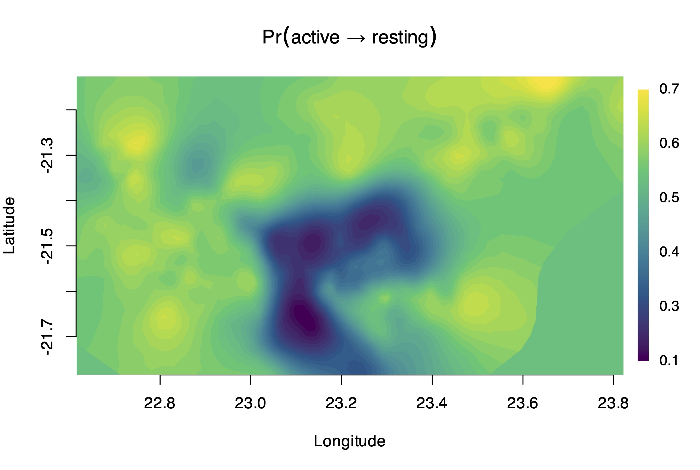

<!-- README.md is generated from README.Rmd. Please edit that file -->

```{r, include = FALSE}
knitr::opts_chunk$set(
  collapse = TRUE,
  comment = "#>"
)
```

# Fast and scalable inference in hidden Markov models with Gaussian fields

This repository contains `R` code for the case studies and simulation experiment presented in the paper <a href="https://arxiv.org/abs/2603.17469" target="blank">"Fast and scalable inference in hidden Markov models with Gaussian fields"</a>. The paper develops fast frequentist estimation techniques for hidden Markov models involving latent Gaussian fields. Estimation is performed via the automatic Laplace approximation implemented in [`RTMB`](https://kaskr.r-universe.dev/RTMB) and Gaussian fields are approximated by Gaussian Markov random fields via the [SPDE approach](https://academic.oup.com/jrsssb/article-abstract/73/4/423/7034732). The main methodological development is a *banded* forward algorithm, available through the `R` package [`LaMa`](https://janolefi.github.io/LaMa/) and its [`forward()`](https://janolefi.github.io/LaMa/reference/forward.html) function.  

Code to reproduce the case studies can be found in the `case_studies` folder while the folder `simulations` contains code for reproducing the simulation experiment.

The figures presented in the paper are provided in the folder `figs` and all data necessary for the case studies can be found in the `data` folder. The raw lion data set cannot be provided in this repository and must be downloaded from [Movebank](https://www.movebank.org/cms/webapp?gwt_fragment=page=studies,path=study3809257699) if of interest.



<br>

When using `LaMa`, please cite the package as follows:

Fischer J.-O. (2026). LaMa: Fast Numerical Maximum Likelihood Estimation for Latent Markov Models. 
R package version 2.1.0. <https://CRAN.R-project.org/package=LaMa>.


